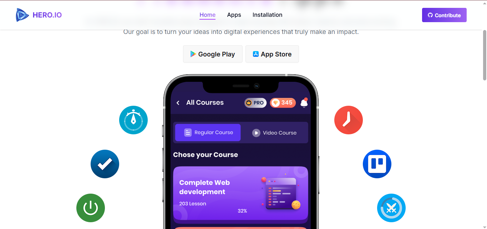

# 🛍️ Hero.io — Online Apps Store

<div align="center">

**Hero.io** is a modern online app store where users can browse, search, install, and uninstall apps with ease.

[](https://online-apps-store.netlify.app/)
[](https://reactjs.org/)
[](https://tailwindcss.com/)


</div>

---

## 📸 Screenshots



---

## Features

-  **Home Page** — Brand hero banner with Google Play & App Store buttons, stats counter (29.6M+ downloads), and a Trending Apps section
-  **Real-time Search** — Instantly filter apps by name on the Apps page
-  **App Details** — View each app's icon, developer, download count, rating, reviews, and full description
-  **Ratings Bar Chart** — Interactive horizontal bar chart powered by Recharts showing star rating breakdown
-  **Install Apps** — One-click install with LocalStorage persistence and toast notifications
-  **Installation Page** — Manage installed apps with sort by name/rating and uninstall functionality
-  **React Suspense** — Loading spinner while trending apps are being fetched
-  **Fully Responsive** — Works seamlessly on mobile, tablet, and desktop
-  **Custom Error Pages** — Dedicated pages for app-not-found and 404 routes

---

## 🛠️ Tech Stack

| Technology | Usage |
|-----------|-------|
|  | UI Library |
|  | Client-side Routing |
|  | Styling |
|  | UI Components |
|  | Bar Chart Visualization |
|  | Toast Notifications |
|  | Icons |
|  | Hosting & Deployment |

---

##  Project Structure

```
online-apps-store/
├── public/
│   ├── apps.json                    # All apps data
│   └── home.json                    # Trending apps data
├── src/
│   ├── assets/
│   │   └── images/
│   │       ├── logo.png
│   │       ├── hero.png
│   │       ├── play.png
│   │       ├── app.png
│   │       ├── App-Error.png
│   │       └── error-404.png
│   ├── components/
│   │   ├── shared/
│   │   │   ├── Navbar.jsx
│   │   │   └── Footer.jsx
│   │   └── pages/
│   │       ├── barCharts/
│   │       │   └── AppDetailsCharts.jsx
│   │       ├── counterPage/
│   │       │   └── Counter.jsx
│   │       └── trendingPage/
│   │           └── TrendingPage.jsx
│   ├── layout/
│   │   └── RootLayout.jsx
│   ├── pages/
│   │   ├── homepage/
│   │   │   └── HomePage.jsx
│   │   ├── apps/
│   │   │   └── Apps.jsx
│   │   ├── details/
│   │   │   └── AppDetails.jsx
│   │   ├── installation/
│   │   │   └── Installation.jsx
│   │   └── NotFoundPage/
│   │       ├── NotFoundPage.jsx
│   │       └── AppFoundErrorPage.jsx
│   ├── routes/
│   │   └── Routes.jsx
│   ├── ui/
│   │   ├── Card.jsx
│   │   └── homeCard.jsx
│   ├── main.jsx
│   └── index.css
├── .gitignore
├── package.json
├── netlify.toml
└── README.md
```

---

##  Routes

| Route | Component | Description |
|-------|-----------|-------------|
| `/` | `HomePage` | Hero banner, stats counter, trending apps |
| `/apps` | `Apps` | All apps grid with real-time search |
| `/apps/:id` | `AppDetails` | App details page with ratings chart |
| `/install` | `Installation` | Installed apps management |
| `*` | `NotFoundPage` | Custom 404 page |

---

##  Getting Started

### Prerequisites

- [Node.js](https://nodejs.org/) (v18+)
- [Git](https://git-scm.com/)

### Installation

```bash
# 1. Clone the repository
git clone https://github.com/IamPial/online-apps-store.git

# 2. Navigate into the project
cd online-apps-store

# 3. Install dependencies
npm install

# 4. Start the dev server
npm run dev
```

Open your browser at: `http://localhost:5173`

### Production Build

```bash
npm run build
```

---

##  Deployment (Netlify)

This project is automatically deployed to Netlify on every push to the `main` branch. Add the following `netlify.toml` to support SPA client-side routing:

```toml
[build]
  command = "npm run build"
  publish = "dist"

[[redirects]]
  from = "/*"
  to = "/index.html"
  status = 200
```

---

##  Contributing

Contributions are always welcome!

1. **Fork** the repository
2. Create a new branch: `git checkout -b feature/your-feature-name`
3. Commit your changes: `git commit -m 'feat: add some feature'`
4. Push to the branch: `git push origin feature/your-feature-name`
5. Open a **Pull Request**

---

## 📄 License

This project is licensed under the [MIT License](LICENSE).

